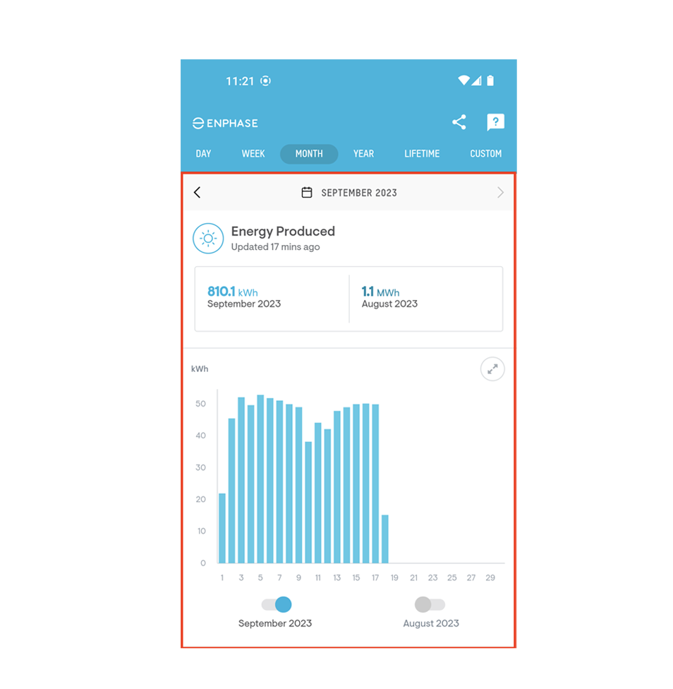
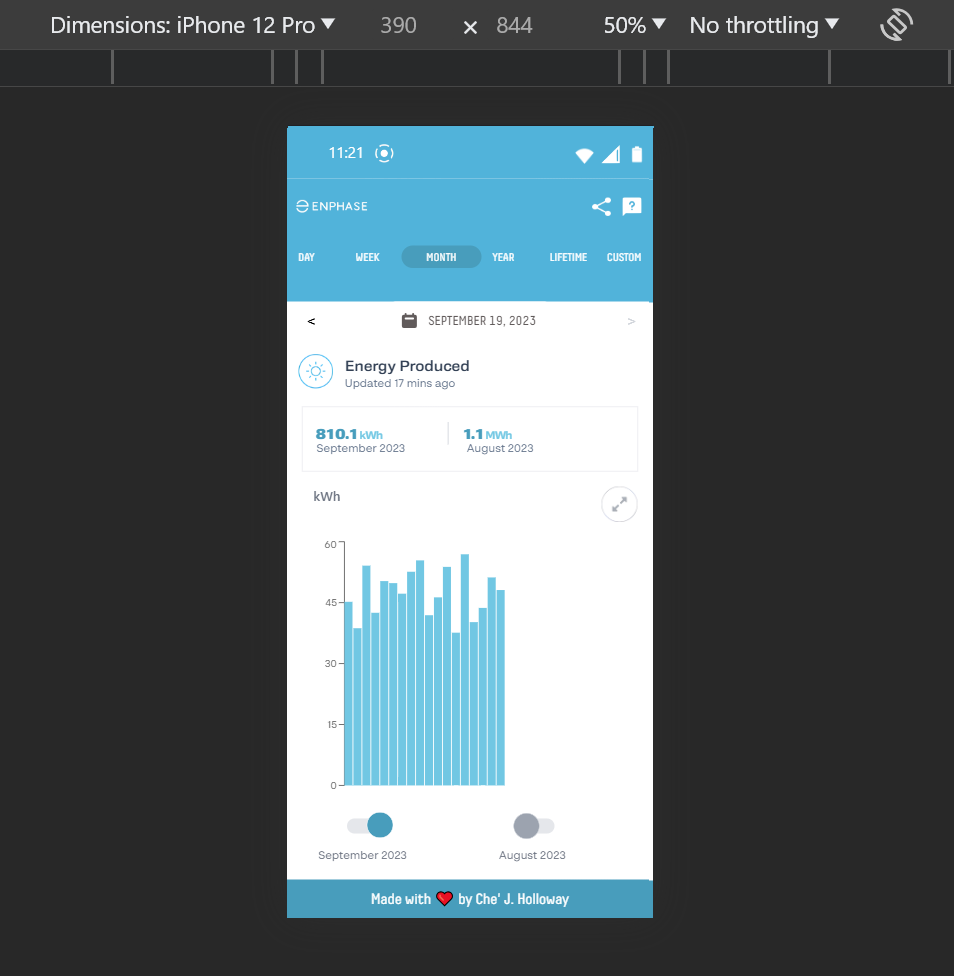

# Bright MX Take Home Test
## Enphase Month Screen

This project was bootstrapped with [Create React App](https://github.com/facebook/create-react-app).

## Available Scripts

### `npm start`

Runs the app in the development mode.

### `npm test`

Launches the test runner in the interactive watch mode.

### `npm run build`

Builds the app for production to the `build` folder.
It correctly bundles React in production mode and optimizes the build for the best performance.

Original Mockup             |  Local Screenshot (Emulator)
:-------------------------:|:-------------------------:
  |  

Here is a link to the surge.sh site that I create to test the app.

[Che' J. Holloway's Enphase App Take Home](http://cjh-brightmx.surge.sh/)

I'm not sure how it displays on an an actual iPhone because I don't own one.

Please use the Chrome Dev tools Emulator(iPhone 9) to view the site in the environment that it was developed in.
